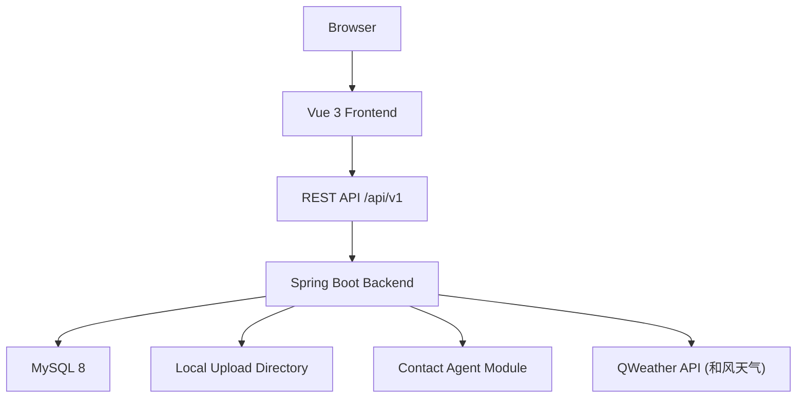

# 系统架构设计 (System Architecture)

## 1. 分层规则 (Layered Architecture Rules)
- **Controller / 接口层**：只负责路由转发、入参校验和统一响应封装，禁止包含核心业务逻辑。
- **Service 业务逻辑层**：处理联系人、事项、看板、活动日志（ActivityLog）、上传、登录和 Agent 的业务规则，必要时声明事务。`ActivityLogService` 作为统一留痕服务，被 `ContactService` 和 `TodoService` 注入并调用。
- **Mapper 数据持久层**：负责 MyBatis-Plus CRUD 和自定义 SQL，禁止写权限、确认、流程控制类逻辑。
- **Config / Security / Interceptor**：统一管理 JWT 鉴权、当前用户上下文、跨域、异常和 MyBatis-Plus 分页等基础设施。
- **Storage / Agent**：分别封装文件存储和 Contact Agent 适配。Agent 模块引入了 `LlmService` 适配层与 `AgentSessionManager` 会话管理器。大模型只负责理解与解析，业务执行完全委托给既有 Service 层。Agent 作为业务编排层，**必须复用并调用**既有的 `ContactService` 与 `TodoService`，严禁直接注入其对应的 Mapper。这确保了在 Agent 交互时，仍然受控于现有业务层的数据隔离（多租户）、黑名单过滤及参数校验机制。对于写操作，系统建立“预处理分析 -> 多轮会话澄清与补槽（若关键信息缺失）-> 返回预确认卡片并在 `agent_operation_log` 标记 pending -> 用户二次确认提交 -> 既有 TodoService 校验并执行落库”的两阶段安全写链路。
- **Weather 代理与缓存服务**：`WeatherService` 负责请求和风天气 API。天气默认定位采用 `address > 浏览器 GEO 坐标 > 客户端 IP > 杭州` 的多级回退链路；对模糊地址或 GEO 坐标统一先解析城市再查询天气，并在此层引入 2 小时内存缓存以节约限额。

## 2. 架构图 (Architecture Diagrams)

## 3. 模块边界 (Module Boundaries)
- 前端模块：`router`、`stores`、`api`、`views`、`components`、`styles`
- 后端模块：`controller`、`service`、`service.impl`、`mapper`、`entity`、`dto`、`vo`、`common`、`config`、`exception`、`interceptor`、`agent`、`storage`
- 活动轨迹留痕边界：`ActivityLogService` 统一管理对 `activity_log` 的异步/同步写日志及归属隔离查询。`ContactService` 与 `TodoService` 写操作成功后向其投递日志；联系人活动流接口 `GET /api/v1/contacts/{contactId}/activities` 严格校验 `contactId` 的租户归属后按时间倒序查出并返回。
- 天气代理边界：后端统一暴露出受鉴权保护的 `/api/v1/weather` 接口，API 密钥（Key）和专属域名配置在 `application.yml` 中由 Spring Boot 管理，禁止前端直连和风天气。
- 系统各核心业务模块（联系人、事项、标签、看板、天气代理、活动轨迹流、智能助手查询）均已实现或在建中。智能助手已具备创建事项的二次确认写闭环能力。

## 4. 启动与联调基线 (Runtime Baseline)
- 后端默认端口：`8080`
- 健康检查：`/actuator/health`
- 前端开发端口：Vite 默认 `5173`
- 推荐联调方式：前端开发代理转发 `/api` 到后端，后端负责 JWT 鉴权和统一错误响应。

## 5. 原始方案索引 (Source Reference)
- 本文为结构化架构摘要。
- 若需要查看更完整的技术选型理由、部署建议和 Agent 模块边界，请回看：`docs/Personal CRM 智能联系人管理平台架构选型.md`。

