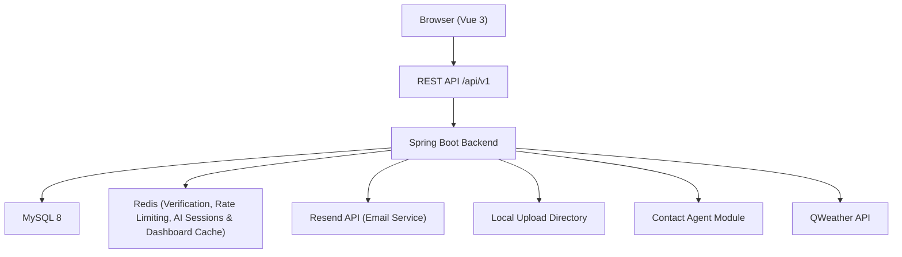
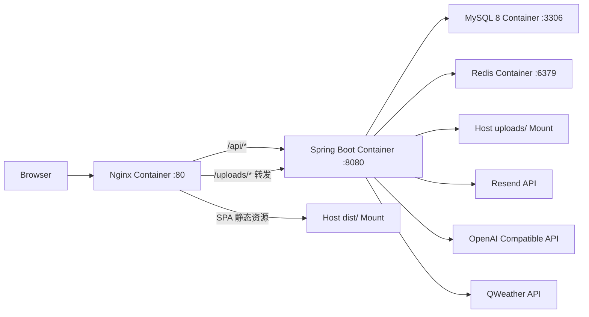

# 系统架构设计 (System Architecture)

## 1. 分层规则 (Layered Architecture Rules)
- **Controller / 接口层**：只负责路由转发、入参校验和统一响应封装，禁止包含核心业务逻辑。
- **Service 业务逻辑层**：处理联系人、事项、看板、活动日志（ActivityLog）、上传、登录和 Agent 的业务规则，必要时声明事务。`ActivityLogService` 作为统一留痕服务，被 `ContactService` 和 `TodoService` 注入并调用。
- **Mapper 数据持久层**：负责 MyBatis-Plus CRUD 和自定义 SQL，禁止写权限、确认、流程控制类逻辑。
- **Config / Security / Interceptor / Redis**：统一管理 JWT 鉴权、当前用户上下文、跨域、异常、MyBatis-Plus 分页以及 Redis 内存存储。在 Redis 中托管临时验证码、60秒发送频率锁、5 次错误锁定计数、**AI 助手多轮对话会话状态（带有 10 分钟自动过期 TTL）**以及**仪表盘看板统计数据的 Hash 结构二级缓存（带有 5 分钟自动失效 TTL 及联系人/事项写操作被动一键清空机制）**。
- **Storage / Agent / Email**：分别封装文件存储、Contact Agent 适配与邮件发送服务。邮件服务封装 `EmailService` 接口，整合 Resend Java SDK，负责发送极简响应式 HTML 验证码邮件。
- **Weather 代理与缓存服务**：`WeatherService` 负责请求和风天气 API。天气默认定位采用 `address > 浏览器 GEO 坐标 > 客户端 IP > 杭州` 的多级回退链路；对模糊地址或 GEO 坐标统一先解析城市再查询天气，并在此层引入 2 小时内存缓存以节约限额。

## 2. 架构图 (Architecture Diagrams)

## 3. 模块边界 (Module Boundaries)
- 前端模块：`router`、`stores`、`api`、`views`、`components`、`styles`
- 后端模块：`controller`、`service`、`service.impl`、`mapper`、`entity`、`dto`、`vo`、`common`、`config`、`exception`、`interceptor`、`agent`、`storage`
- 邮箱验证码与安全闭环边界：`EmailService` 与 Redis 配合负责校验与发信。接口层包括验证码发送、激活校验、密码重置与邮箱更名。激活成功后直接同步修改 `sys_user` 数据库表中对应的 `status` 与激活时间戳字段（TASK-016）。
- 活动轨迹留痕边界：`ActivityLogService` 统一管理对 `activity_log` 的异步/同步写日志及归属隔离查询。`ContactService` 与 `TodoService` 写操作成功后向其投递日志；联系人活动流接口 `GET /api/v1/contacts/{contactId}/activities` 严格校验 `contactId` 的租户归属后按时间倒序查出并返回。
- Redis 缓存与分布式会话边界：
  - 看板数据在 `DashboardController` 使用 Redis Hash 缓存存储，Key 名为 `dashboard:cache:{userId}`，统计指标分为四个 Hash Field，每个 Field 存储 JSON 格式的 VO 对象，缓存时间 300 秒，写操作一键删除该 Key。
  - AI 多轮对话在 `AgentSessionManager` 中通过 `agent:session:{sessionId}` 键存储序列化为 JSON 的 `AgentSessionState` 对象，TTL 设为 600 秒。
- 天气代理边界：后端统一暴露出受鉴权保护的 `/api/v1/weather` 接口，API 密钥（Key）和专属域名配置在 `application.yml` 中由 Spring Boot 管理，禁止前端直连和风天气。
- 系统各核心业务模块（联系人、事项、标签、看板、天气代理、活动轨迹流、智能助手查询、邮箱安全闭环）均已实现或在建中。智能助手已具备创建事项的二次确认写闭环能力。

## 4. 启动与联调基线 (Runtime Baseline)
- 后端默认端口：`8080`
- 健康检查：`/actuator/health`
- 前端开发端口：Vite 默认 `5173`
- 推荐联调方式：前端开发代理转发 `/api` 到后端，后端负责 JWT 鉴权和统一错误响应。

## 5. 单机部署拓扑与 Agent 交付边界 (TASK-018)

### 5.1 部署拓扑

### 5.2 服务职责
- `nginx`：托管前端 `dist` 静态资源，处理 Vue Router 的 `try_files` 回退，并把 `/api/` 与 `/uploads/` 反向代理到后端。
- `backend`：以 Spring Boot Jar 形式运行，负责业务接口、JWT 鉴权、文件访问、Redis 缓存、MySQL 读写以及第三方服务调用。
- `mysql`：承载业务数据；首次部署可通过 `SPRING_SQL_INIT_MODE=always` 执行 `schema.sql` 与 `data.sql` 初始化演示数据。
- `redis`：承载验证码、频控、Agent 会话状态与看板缓存。
- `uploads`：必须使用宿主机持久化目录挂载到后端容器，避免容器重建导致联系人头像与用户头像丢失。

### 5.3 Agent 部署职责边界
- 本地开发者负责定稿并提交部署文件，包括 `.env.example`、`docker-compose.yml`、`personal_crm_backend/Dockerfile`、`deploy/nginx.conf` 与 `docs/5-deploy/` 文档。
- 服务器上的 Agent 只负责拉取仓库、在宿主机构建前端 `dist`、校验环境变量、执行 `docker compose up`、按文档完成验证与排障。
- 本任务不引入镜像仓库、CI/CD 流水线、多机编排或云资源管理。

## 6. 原始方案索引 (Source Reference)
- 本文为结构化架构摘要。
- 若需要查看更完整的技术选型理由、部署建议和 Agent 模块边界，请回看：`docs/Personal CRM 智能联系人管理平台架构选型.md`。

