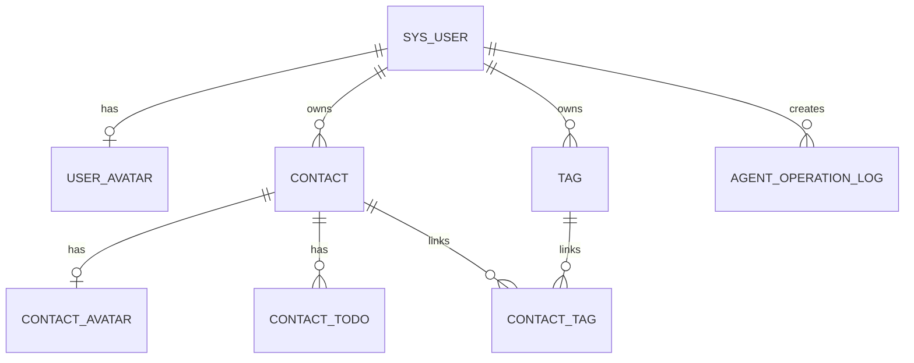

# 数据库设计 (Database Schema)

## 1. 建表基线与设计原则 (Conventions)
- **命名规范**：使用下划线命名，例如 `user_id`、`contact_id`、`todo_status`。
- **通用字段**：核心业务表统一包含主键、创建时间、更新时间；逻辑删除按业务需要单独评估。
- **物理外键**：默认不使用物理外键约束，由应用层和索引策略维护关系一致性。
- **归属隔离**：所有核心业务数据必须直接或间接关联 `user_id`，以支持用户数据隔离。

## 2. ER 实体关系图 (Entity Relationship Diagram)

## 3. 规划表基线 (Planned Tables)
| 表名 | 作用 | 当前状态 |
|---|---|---|
| `sys_user` | 登录用户与身份隔离 | 已定稿 |
| `user_avatar` | 用户头像元数据 | 已定稿 |
| `contact` | 联系人基础信息与黑名单状态 | 已定稿 |
| `contact_avatar` | 联系人头像元数据 | 已定稿 |
| `contact_todo` | 联系人事项与状态流转 | 已定稿 |
| `tag` | 联系人标签 | 已定稿（扩展） |
| `contact_tag` | 联系人与标签多对多关系 | 已定稿（扩展） |
| `agent_operation_log` | Agent 输入、意图、确认与结果留痕 | 已定稿（扩展） |

## 4. 已扫描的数据表结构 (Scanned Database Tables)
- 当前初始化 DDL 已写入 `personal_crm_backend/src/main/resources/schema.sql`。
- 当前表清单与 `docs/Personal CRM 智能联系人管理平台数据库设计.md` 和 `schema.sql` 保持一致。
- 课程验收基线为 5 张表：`sys_user`、`user_avatar`、`contact`、`contact_avatar`、`contact_todo`。
- 项目扩展表为：`tag`、`contact_tag`、`agent_operation_log`。

## 5. 数据修补备注 (Data Fixes)
- **TASK-004** 发现并修正了 `contact_tag` 表种子数据中的多租户归属问题，将错归属于未定义用户 `U000000003` 和 `U000000004` 的关联数据全部安全划归为当前演示用户 `U000000001`，确保多租户隔离与隔离关系的强一致性。

## 6. 原始方案索引 (Source Reference)
- 本文为结构化数据库摘要。
- 若需要查看字段级设计说明、状态定义、索引设计和指导书基线对齐说明，请回看：`docs/Personal CRM 智能联系人管理平台数据库设计.md`。
