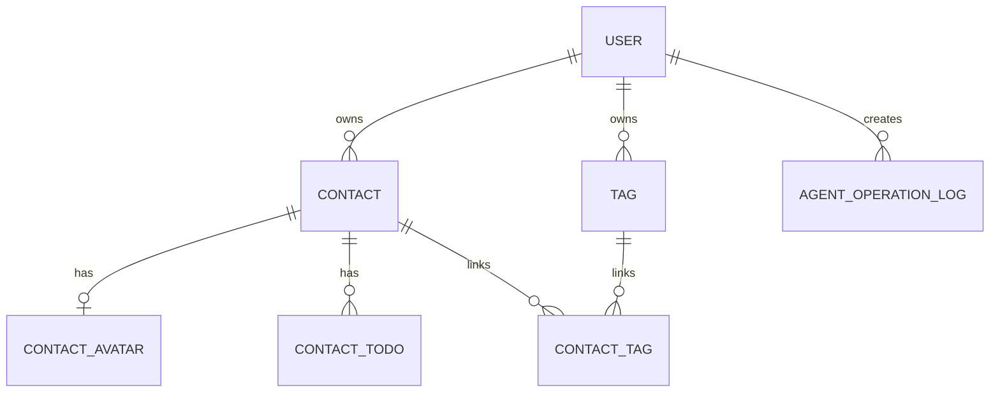

# 数据库设计 (Database Schema)

## 1. 建表基线与设计原则 (Conventions)
- **命名规范**：使用下划线命名，例如 `user_id`、`contact_id`、`todo_status`。
- **通用字段**：核心业务表统一包含主键、创建时间、更新时间；逻辑删除按业务需要单独评估。
- **物理外键**：默认不使用物理外键约束，由应用层和索引策略维护关系一致性。
- **归属隔离**：所有核心业务数据必须直接或间接关联 `user_id`，以支持用户数据隔离。

## 2. ER 实体关系图 (Entity Relationship Diagram)

## 3. 规划表基线 (Planned Tables)
| 表名 | 作用 | 当前状态 |
|---|---|---|
| `user` | 登录用户与身份隔离 | 待设计 |
| `contact` | 联系人基础信息与黑名单状态 | 待设计 |
| `contact_avatar` | 联系人头像元数据 | 待设计 |
| `contact_todo` | 联系人事项与状态流转 | 待设计 |
| `tag` | 联系人标签 | 待设计 |
| `contact_tag` | 联系人与标签多对多关系 | 待设计 |
| `agent_operation_log` | Agent 输入、意图、确认与结果留痕 | 待设计 |

## 4. 已扫描的数据表结构 (Scanned Database Tables)
- 暂无已实现 DDL、实体类或迁移文件。
- 当前表清单来自 `docs/Personal CRM 智能联系人管理平台架构选型.md` 的规划基线，后续真实落地时必须同步更新本文件。
